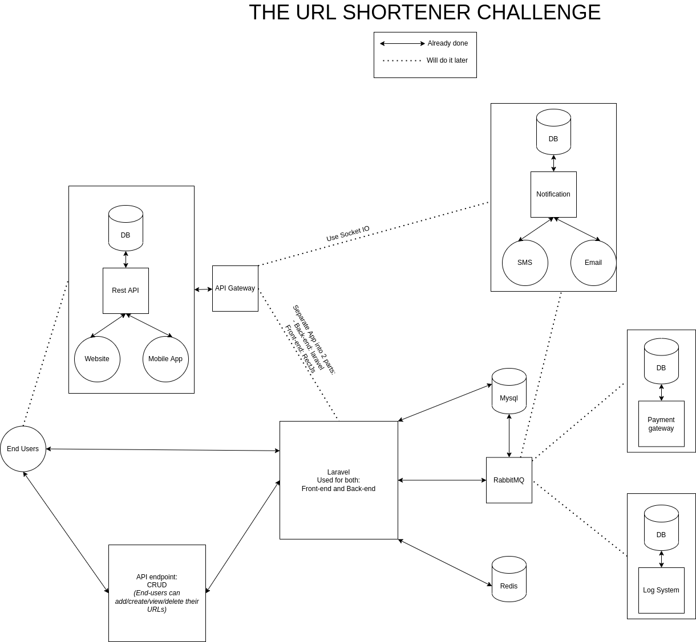

[](http://localhost:8168/ "Tiny Url")

---
# Tiny URL

## System requirements
- [Docker](https://docs.docker.com/engine/install/)
- [Docker-compose](https://docs.docker.com/compose/install/)
- [Git](https://git-scm.com/book/en/v2/Getting-Started-Installing-Git)

## Installation

1. git clone git@github.com:spiderbox/rails-assessment.git
2. cd rails-assessment
3. docker-compose up --build -d --force-recreate (**for the first time**)
4. docker-compose up -d (**for the remaining time**)
5. docker-compose exec www bash
6. ./scripts/update.sh
7. ./scripts/rabbitmq.sh &
8. [Click here](http://localhost:8168/)

## User Information
1. `Super admin`: `khoa@abc.def/12121212`
2. `Normal user`: `khoapham10101@gmail.com/12121212`

## Postman Information
1. Import this file to your posman to test API endpoint: `www/postman/TinyUrl.postman_collection.json`

## System Information
[](http://localhost:8168/documents/SpiderBox-Shorten-Url.png "System Structure")

Let’s consider we are using 7 characters to generate a short URL. These characters are a combination of 62 characters [A-Z, a-z, 0-9] something like http://localhost:8168/XzdVA86
1 shorten url row has around 100 to over thousands characters: example
```
id  user_id   short_url   long_url                                           hits    created_at          updated_at
104 32110     2MEbgAD     http://corwin.com/qui-voluptatem-consequatur-ducim   1     2022-01-19 13:19:46 2022-01-19 13:19:46
```
Consider average long row size of 2KB(for 2048 characters). If we calculate the total storage then for 30 millions active users
total size = 30.000.000 * 2 = 60.000.000 KB = 57.3 GB per month. In a year of 0.68 TB and in 5 years 3.5 TB of data.
Our system need a lot of storage :)
---
:rocket: :rocket: :rocket: :rocket: :rocket: :rocket: :rocket: :rocket: :rocket: :rocket: :rocket: :rocket: :rocket: :rocket: :rocket: :rocket: :rocket: :rocket: :rocket: :rocket: :rocket: :rocket: :rocket: :rocket:
